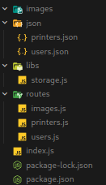
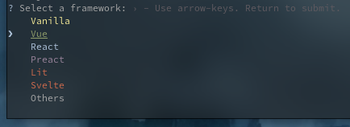
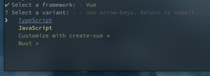
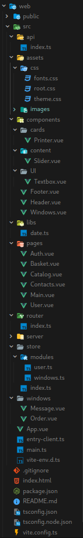

# Подготовка к работе

Для начала установим NodeJS для работы проекта.

Скачайте exe файл с [сайта](https://nodejs.org/en) LTS версию
Но если у вас он уже есть то можете пропустить этот шаг.

Можно проверить просто зайдя в поиск Windows и написать Node.


# 1.0 Создание сервера

### 1.1 Подготовка проекта

Для того чтобы у нас работал севрер нужно иницилизировать проект

Создайте папку ` Server ` откройте в этой папке ` cmd ` и напишите
```shell
npm init
```

Все остальные пункты можете пропустить.

Для того чтобы проекта мог выполнять назначенные функции ему нужны определенные пакеты.
Для этого напишите в консоль:
```shell
npm i --save express dotenv cors body-parser
```

---

### 1.2 Структура папок и файлов

Теперь мы создадим файлы и папки с которыми мы в дальнейшем будем работать



Повторите расположение папок и файлов как на картинке, без `package.json` и `package-lock.json` и без файла `users.json` в папке `json` (в будущем он сам появится)

Перенестите картинки `1.png` и `2.png` из папки `printers` в папке `assets`

Создайте файл `printers.json` в папке `json` (создайте если ее нет)

И встате следуйщик код

```json
[
    {
        "id": 0,
        "image": "http://localhost:4000/images/1.jpg",
        "name": "Принтер 1",
        "price": 324
    },
    {
        "id": 1,
        "image": "http://localhost:4000/images/2.jpg",
        "name": "Принтер dfa",
        "price": 33
    },
    {
        "id": 2,
        "image": "http://localhost:4000/images/1.jpg",
        "name": "Принтер 5",
        "price": 854
    }
]
```

---

### 1.3 Начала кода

Теперь нам нужно написать код для того наш сервер работал.

Зайдем в `index.js` в корневой папке.

И начнем писать код.

Первое что нам нужно это подключить пакеты.

```js
const
    express = require('express'),
    app = express(),
    bodyParser = require('body-parser'),
    cors = require('cors'),
    fs = require('fs'),
    path = require('path');
```

Далее сделать так чтобы у севрера были определенные разрешенные параметры для того чтобы мы могли делать запросы на сервер.

```js
app.set('trust proxy', true);

app.use(bodyParser.json());
app.use(bodyParser.urlencoded({ extended: false }));

app.use(cors({
    origin: '*',
    allowedHeaders: 'Content-Type, Content-Length, Authorization, Accept, X-Requested-With',
    methods: 'GET, POST, PUT, PATCH, DELETE'
}));
```

Также нужно сделать так чтобы папка `json` и файлы в ней создавались автоматически в случаи если их нет.
```js
let folder = path.join(__dirname, 'json'),
    fileUsers = path.join(folder, 'users.json'),
    filePrinters = path.join(folder, 'printers.json');

if (!fs.existsSync(folder)) fs.mkdirSync(folder);
if (!fs.existsSync(fileUsers)) fs.writeFileSync(fileUsers, '[]', { encoding: 'utf-8' });
if (!fs.existsSync(filePrinters)) fs.writeFileSync(filePrinters, '[]', { encoding: 'utf-8' });
```

Инициализируем все роутеры которые будут отвечать за свою логику.
```js
app.use('/users', require('./routes/users.js'));
app.use('/printers', require('./routes/printers.js'));
app.use('/images', require('./routes/images.js'));
```

И под конец инициализируем севрер под определенным портом для того чтобы можно было легко обращаться к нему через порт.
```js
let port = 4000,
    server = app.listen(port, () => {
    console.log(`Server started http://localhost:${port}`);
});
```

---

### 1.4 Создание библеотеки для работы с папкой `json`

Откроем файл `storage.js` в папке `libs`

Для работы нужно также свои библеотеки для работы с файловой системой
```js
const
    fs = require('fs'),
    path = require('path');
```

Запишим наши путик к файлам для дальнейшей работы с ними.
```js
let folder = path.join(__dirname, '../json'),
    fileUsers = path.join(folder, 'users.json'),
    filePrinters = path.join(folder, 'printers.json');
```

Теперь создадим функции которые позволят нам работать с файлом `users.json` который отвечает за пользователей.
```js
function getUsers() {
    try {
        let users = JSON.parse(fs.readFileSync(fileUsers, { encoding: 'utf-8' }));

        return users;
    } catch (err) {
        return []
    }
}

function getUser(login = '') {
    try {
        let users = getUsers();

        return users.find(user => user.login === login);
    } catch (err) {
        return {}
    }
}

function createUser(login, password, firstName, lastName, patronymic = '', mail) {
    try {
        let users = getUsers();

        users = [...users || [], {
            id: users.length + 1,
            login,
            password,
            firstName,
            lastName,
            patronymic: patronymic || '',
            mail,
            orders: [],
            busket: []
        }];

        fs.writeFileSync(fileUsers, JSON.stringify(users, null, 4), { encoding: 'utf-8' });

        return true;
    } catch (err) {
        console.log(err);
        return false;
    }
}

function updateUser(login, newBody = {}) {
    try {
        let users = getUsers(),
            userIndex = users.findIndex(user => user.login === login);

        users[userIndex] = newBody;

        fs.writeFileSync(fileUsers, JSON.stringify(users, null, 4), { encoding: 'utf-8' });

        return true;
    } catch (err) {
        console.log(err);
        return false;
    }
}
```

Также нам нужны функции для работы с файлом `printers.json` который отвечает за принтеры.
```js
function getPrinters() {
    try {
        let printers = JSON.parse(fs.readFileSync(filePrinters, { encoding: 'utf-8' }));

        return printers;
    } catch (err) {
        return []
    }
}

function getPrinter(printerId = 0) {
    try {
        let printers = getPrinters();

        return printers.find(printer => printer.id === printerId);
    } catch (err) {
        return {}
    }
}
```

В конце нам нужно экспортировать все функции для работы в будущем с ними.
```js
module.exports = {
    getUsers,
    getUser,
    createUser,
    updateUser,
    getPrinters,
    getPrinter
}
```

---

### 1.5 Создание роутера для работы с картинками

Откроем файл `images.js` в папке `routes`

Снова нужно подключить нужные пакеты для работы
```js
const
    { Router } = require('express'),
    router = Router(),
    fs = require('fs'),
    path = require('path');
```

Создами переменную которая будет отвечать за папку `images`,
а также маршрут который позволит нам получать в будущем картинки принтеров через запрос к севреру.
```js
let folder = path.join(__dirname, '../images');

router.get('/:name', async (req, res) => {
    try {
        let imagePath = path.join(folder, req.params.name);

        if (!fs.existsSync(imagePath)) return res.status(404).json({ message: 'Такой картинки нет.', code: 404 });

        res.sendFile(imagePath);
    } catch (err) {
        console.log(err);
        res.status(501).json({ message: 'Ошибка на сервере', code: 501 });
    }
});
```

И экспортируем наш роутер.
```js
module.exports = router;
```

---

### 1.6 Создание роутера для работы с пользователями

Откроем файл `users.js` в папке `routes`

Подлючаем пакеты, а также подлючим нашу библеотеку для работы с файлами.
```js
const
    { Router } = require('express'),
    router = Router(),
    { getUser, createUser, updateUser, getPrinters } = require('../libs/storage.js');
```

Создаем запрос на авторизацию пользователя
```js
router.post('/login', async (req, res) => {
    let { login, password } = req.body;

    if (!login || !password) return res.status(401).json({ message: 'Вы не ввели логин или пароль', code: 401 });

    try {
        let user = getUser(login);

        if (!user) return res.status(404).json({ message: 'Такого пользователя нет.', code: 404 });

        if (user.password !== password) return res.status(401).json({ message: 'Вы ввели не правильный пароль от пользователя.', code: 404 });

        return res.status(200).json(user);
    } catch (err) {
        console.log(err);
        res.status(501).json({ message: 'Ошибка на сервере', code: 501 });
    }
});
```

Создаем запрос на регистрацию нового пользователя
```js
router.post('/register', async (req, res) => {
    let { login, password, firstName, lastName, patronymic, mail } = req.body;

    if (!login || !password || !firstName || !lastName || !mail) return res.status(401).json({ message: 'Вы не указали все поля для регистрации.', code: 401 });

    try {
        let user = getUser(login);

        if (user) return res.status(401).json({ message: 'Такой пользователь уже есть.', code: 401 });

        createUser(login, password, firstName, lastName, patronymic, mail);

        return res.status(200).json({ message: 'Пользователь создан.', code: 200 });
    } catch (err) {
        console.log(err);
        res.status(501).json({ message: 'Ошибка на сервере', code: 501 });
    }
});
```

Запрос для того чтобы узнать карзину пользователя
```js
router.get('/:userId/busket', async (req, res) => {;
    try {
        let user = getUser(req.params.userId),
            printers = getPrinters();

        if (!user) return res.status(404).json({ message: 'Такого пользователя нет.', code: 404 });

        res.status(200).json(user.busket.map(printer => {
            let p = printers.find(p => p.id === printer.id);
            return { ...printer, ...p };
        }));
    } catch (err) {
        console.log(err);
        res.status(501).json({ message: 'Ошибка на сервере', code: 501 });
    }
});
```

Запрос для добавления товара в корзину
```js
router.post('/:userId/busket', async (req, res) => {
    let { printerId } = req.body;

    if (printerId === undefined) return res.status(401).json({ message: 'Вы не указали printerId в body', code: 401 });

    try {
        let user = getUser(req.params.userId);

        if (!user) return res.status(404).json({ message: 'Такого пользователя нет.', code: 404 });

        if (user.busket.find(printer => printer.id === printerId)) return res.status(401).json({ message: 'Этот товар уже есть в корзине', code: 401 });

        user.busket = [...user.busket || [], { id: printerId, count: 1 }];

        updateUser(user.login, user);

        res.status(200).json({ message: 'Товар успешно добавлен в корзину.', code: 200 });
    } catch (err) {
        console.log(err);
        res.status(501).json({ message: 'Ошибка на сервере', code: 501 });
    }
});
```

Запрос для удаления товара из корзины
```js
router.delete('/:userId/busket/:printerId', async (req, res) => {
    try {
        let user = getUser(req.params.userId);

        if (!user) return res.status(404).json({ message: 'Такого пользователя нет.', code: 404 });

        user.busket = user.busket.filter(printer => printer.id !== Number(req.params.printerId));

        updateUser(user.login, user);

        res.status(200).json({ message: 'Товар успешно удален из корзину.', code: 200 });
    } catch (err) {
        console.log(err);
        res.status(501).json({ message: 'Ошибка на сервере', code: 501 });
    }
});
```

Запрос для получение всех заказов пользователя
```js
router.get('/:userId/orders', async (req, res) => {;
    try {
        let user = getUser(req.params.userId),
            printers = getPrinters();

        if (!user) return res.status(404).json({ message: 'Такого пользователя нет.', code: 404 });

        let result = user.orders.map(order => {
            let products = order.products.map(pr => ({ ...pr, ...printers.find(p => p.id === pr.id) }));
            return { ...order, products };
        });

        res.status(200).json(result);
    } catch (err) {
        console.log(err);
        res.status(501).json({ message: 'Ошибка на сервере', code: 501 });
    }
});
```

Запрос для оформления заказа
```js
router.post('/:userId/order', async (req, res) => {
    try {
        let user = getUser(req.params.userId);

        if (!user) return res.status(404).json({ message: 'Такого пользователя нет.', code: 404 });

        user.orders = [...user.orders || [], {
            id: user.orders?.length + 1,
            status: 1,
            products: user.busket,
            createdAt: Date.now()
        }];

        user.busket = [];

        updateUser(user.login, user);

        res.status(200).json({ message: 'Заказ успешно оформлен.', code: 200 });
    } catch (err) {
        console.log(err);
        res.status(501).json({ message: 'Ошибка на сервере', code: 501 });
    }
});
```

Экспорт роутера в конце
```js
module.exports = router;
```

---

### 1.7 Создание роутера для работы с принтерами

Откроем файл `printers.js` в папке `routes`

Подлючаем пакеты, а также подлючим нашу библеотеку для работы с файлами.
```js
const
    { Router } = require('express'),
    router = Router(),
    { getPrinters } = require('../libs/storage.js');
```

Создаем запрос для получения всего списка существующих принтеров в базе.
```js
router.get('/', async (req, res) => {
    let printers = getPrinters();

    res.status(200).json(printers);
});
```

Экспорт роутера
```js
module.exports = router;
```

---

### 1.8 Итоговый запуск севрера

Для того чтобы запускать сервер в `Node.js` нужно открыть консоль и написать следущий команду
```shell
node .
```

---

# 2.0 Создание сайта

### 2.1 Подготовка проекта

Для того чтобы у нас работал сайт нужно иницилизировать проект

Возвращаем к папке ` Server ` и в той же иерархии папок создаем пишим команду в ` cmd ` где и папка ` Server `
```shell
npm create vite@latest
```
Вас спросят название проекта, можете написать что хотите.



Выбираем ` Vue ` и нажимаем `enter`



Далее выбираем ` TypeScript ` и также нажимаем ` enter `

Теперь переходим в нашу только что созданную папку ` web ` и открываем ее и пишим следащию команду для установки всех нужных пакетов
```js
npm i
```

Для того чтобы проекта мог выполнять назначенные функции ему нужны определенные пакеты.
Для этого напишите в консоль:
```shell
npm i --save @types/node
```

А также следущие команды
```shell
npm i -D sass vue-router vuex @vue/cli-plugin-router
```

Теперь надо создать файт `.env` в корневой папке сайта и написать следующий код
```
VITE_API_URL=http://localhost:4000
```
Это нужно для того чтобы сайт понимал на какой и куда сервер отправлять запросы

`http://localhost:4000` Потому что наш сервер работает на этом порту

---

### 2.2 Структура папок и файлов

Теперь мы создадим файлы и папки с которыми мы в дальнейшем будем работать



---

### 2.3 Подготовка глобальных стилей

Создаем в папке `src/assets` папку `css` и в ней следущие файлы

1. Файл `fonts.css`
```css
:root {
    /* --font-family: 'Open Sans', sans-serif; */
    /* --font-family: Avenir, Helvetica, Arial, sans-serif; */
    /* --font-family: "Raleway", sans-serif; */
    --font-family: Inter, -apple-system, BlinkMacSystemFont, 'Segoe UI', Roboto, Oxygen, Ubuntu,
                   Cantarell, 'Fira Sans', 'Droid Sans', 'Helvetica Neue', sans-serif;
}
```

2. Файл `root.css`
```css
@import url('./fonts.css');
@import url('./theme.css');

* {
    margin: 0;
    padding: 0;
    font-family: var(--font-family);
    box-sizing: border-box;
}

body {
    font-size: 14px;
    transition: .2s;
    overflow-x: hidden;
}

ul, li {
    list-style-type: none;
}
a {
    color: var(--color-primary);
    text-decoration: none;
}
input, textarea {
    outline: none;
    border: none;
    font-family: var(--font-family);
}

xmp {
    font-family: var(--font-family);
    white-space: pre;
    margin: 0px;
}

p {
    display: block;
    margin-block-start: 0px;
    margin-block-end: 0px;
    margin-inline-start: 0px;
    margin-inline-end: 0px;
}

table {
    border-spacing: 0px;
}
```

3. Файл `theme.css`
```css
:root {
    --T: transparent;
}

html[theme="dark"]:root {
    --color-primary: #e8e8e8;
    --background-primary: #010101;
}

html[theme="light"]:root {
    --color-primary: #010101;
    --color-primary-alt: #171717;

    --background-primary: #fff;
}
```

Откроем файл `main.ts`

И добавим следуйщих код после ` import App from './App.vue'; `
```ts
import './assets/css/root.css';
```

Также перенесите файлы из папки `assets/web` в папку сайта `src/assets/images`

Откройте файл `index.html` в корневой папке сайта

И замените его код на этот
```html
<!DOCTYPE html>
<html lang="en">
<head>
    <meta charset="UTF-8" />
    <link rel="icon" type="image/svg+xml" href="/vite.svg" />
    <meta name="viewport" content="width=device-width, initial-scale=1.0" />
    <title>CopyStar</title>

    <link rel="stylesheet" href="https://unicons.iconscout.com/release/v4.0.8/css/line.css">
</head>
<body>
    <div id="app"></div>
    <script type="module" src="/src/main.ts"></script>
</body>
</html>
```

---

### 2.4 Подготовка плагинов

#### 2.4.1 Плагин Vuex

Создаем файл `index.ts` в папке `src/store`

Добавляем следующий код
```ts
import { createStore, type StoreOptions, Store, Module } from 'vuex';

// * Modules
import windows from './modules/windows';
import user from './modules/user';

let modules: any = {
    windows,
    user
}

const store = createStore({
    modules
});

export default store;
```

Также нам нужны модули для `Vuex`, которые мы сами напишим

1. Молуль `User` для работы с личным пользователем

Создаем файл `user.ts` в папке `src/store/modules`

И пишим следующий код
```ts
import type { StoreOptions } from 'vuex';

// Интерфейсы 
interface ICatalog {}

interface IUser {
    id: number;
    login: string;
    password: string;
    firstName: string;
    lastName: string;
    patronymic: string;
    mail: string;
    catalog: ICatalog;
}

interface State {
    user: IUser;
}

const module: StoreOptions<State> = {
    state: {
        user: {} as IUser
    },
    mutations: {
        'user:set'(state: State, user: IUser) {
            state.user = user;
        }
    },
    actions: {
        setUser({ commit }, user: IUser) {
            return commit('user:set', user);
        }
    },
    getters: {
        getUser(state: State): IUser {
            return state.user;
        }
    }
}

export default module;
```

2. Молуль `Windows` для работы с модальными окнами

Создаем файл `windows.ts` в папке `src/store/modules`

И пишим следующий код
```ts
import type { Component } from 'vue';
import type { StoreOptions } from 'vuex';

export type TPosition = 'top' | 'top left' | 'top right' | 'center' | 'center left' | 'center right' | 'bottom' | 'bottom left' | 'bottom right';

export interface IButton {
    id: number;
    label?: string;
    text?: string;
    color?: string;
    click?(e: Event): void;
}

export interface IWindow {
    id: number;
    title: string;
    message?: string;
    component?: Component;
    color?: string;
    position?: TPosition;
    hide?: boolean;
    data?: object;
    props?: object;
    buttons?: IButton[];
    createdAt: number;
}

interface State {
    list: IWindow[];
}

const module: StoreOptions<State> = {
    state: {
        list: []
    },
    mutations: {
        'windows:create'(state: State, window: IWindow) {
            state.list = [...state.list, {
                position: 'center',
                buttons: [],
                ...window,
                id: state.list.length + 1,
                createdAt: Date.now()
            }];
        },
        'windows:hide'(state: State, windowId: number) {
            let window: IWindow | any = state?.list?.find((n: IWindow) => n.id === windowId);
            window.hide = true;
        },
        'windows:remove'(state: State, windowId: number) {
            state.list = state.list.filter(n => n.id !== windowId);
        },
        'windows:buttons:add'(state: State, { windowId, buttons }: { windowId: number, buttons: IButton[] }) {
            let windowIndex: number = state.list.findIndex((window: IWindow) => window.id === windowId);

            state.list[windowIndex].buttons = [
                ...state.list[windowIndex].buttons || [],
                ...buttons
            ]
        },
        'windows:buttons:remove'(state: State, { windowId, buttonIds }: { windowId: number, buttonIds: number[] }) {
            let windowIndex: number = state.list.findIndex((window: IWindow) => window.id === windowId);

            state.list[windowIndex].buttons = state.list[windowIndex].buttons?.filter((btn: IButton) => !buttonIds.find(id => id === btn.id));
        }
    },
    actions: {
        createWindow({ commit }, window: IWindow) {
            return commit('windows:create', window);
        },
        hideWindow({ commit }, windowId: number) {
            return commit('windows:hide', windowId);
        },
        removeWindow({ commit }, windowId: number) {
            return commit('windows:remove', windowId);
        },
        addWindowButtons({ commit }, { windowId, buttons }: { windowId: number, buttons: IButton[] }) {
            return commit('windows:buttons:add', { windowId, buttons });
        },
        removeWindowButtons({ commit }, { windowId, buttonIds }: { windowId: number, buttonIds: number[] }) {
            return commit('windows:buttons:add', { windowId, buttonIds });
        }
    },
    getters: {
        getListWindows(state: State): IWindow[] {
            return state.list;
        }
    }
}

export default module;
```


#### 2.4.2 Плагин VueRouter

Создаем файл `index.ts` в папке `src/router`

Добавляем следующий код
```ts
import { createRouter, createMemoryHistory, createWebHistory, type RouteRecordRaw } from 'vue-router';

import Auth from '../pages/Auth.vue';

let baseUrl = import.meta.env.BASE_URL;

const routes: RouteRecordRaw[] = [
    {
        name: 'MainPage',
        path: '/',
        component: () => import('../pages/Main.vue')
    },
    {
        name: 'CatalogPage',
        path: '/catalog',
        component: () => import('../pages/Catalog.vue')
    },
    {
        name: 'ContactsPage',
        path: '/contacts',
        component: () => import('../pages/Contacts.vue')
    },
    {
        name: 'RegisterPage',
        path: '/register',
        component: Auth,
        props: () => ({ type: 'register' })
    },
    {
        name: 'LoginPage',
        path: '/login',
        component: Auth,
        props: () => ({ type: 'login' })
    },
    {
        name: 'UserPage',
        path: '/profile',
        component: () => import('../pages/User.vue')
    },
    {
        name: 'BasketPage',
        path: '/basket',
        component: () => import('../pages/Basket.vue')
    }
];

const router = createRouter({
    history: import.meta.env.SSR ? createMemoryHistory(baseUrl) : createWebHistory(baseUrl),
    routes
});

export default router;
```

---

### 2.5 Наша библеотека для работы со временем

Создайте файл `date.ts` в папке `src/libs`

Добавлете следующий код в этот файт
```ts
export function uts(UT: number, one: string, two: string, five: string): string {
    if (`${UT}`.split('').reverse()[1] === '1') return `${UT}${five}`;
    if (`${UT}`.split('').reverse()[0] === '1') return `${UT}${one}`;
    if (+(`${UT}`.split('').reverse()[0]) >= 2 && +(`${UT}`.split('').reverse()[0]) <= 4) return `${UT}${two}`;
    return `${UT}${five}`;
}

export let monthsName: string[] = ['january', 'february', 'martha', 'april', 'may', 'june', 'july', 'august', 'september', 'october', 'november', 'december'];
export let miniMonthsName: string[] = ['jan', 'feb', 'mar', 'apr', 'may', 'jun', 'jul', 'aug', 'sep', 'oct', 'nov', 'dec'];

export function getString(input: number): string {
    return input < 10 ? `0${input}` : input.toString();
}

export function unix(unix: number | string = Date.now()) {
    let date = new Date(unix),
        year = date.getFullYear(),
        day = getString(date.getDate()),
        month = getString(date.getMonth()),
        hours = getString(date.getHours()),
        minutes = getString(date.getMinutes()),
        seconds = getString(date.getSeconds());

    return {
        year,
        day,
        month,
        month_name: monthsName[Number(month)],
        hours,
        minutes,
        seconds
    }
}

export interface IFormat {
    YYYY: string;
}

export function unixFormat(time: number | string = Date.now(), format: string = 'dd MMM YYYY'): string {
    let { year, day, month, hours, minutes, seconds } = unix(time),
        miniMonth = miniMonthsName[Number(month)],
        fullMonth = monthsName[Number(month)],
        types = {
        // * Year
        YYYY: year,
        YY: year.toString().slice(2),
        // * Month
        MMMM: fullMonth[0].toLocaleUpperCase() + fullMonth.slice(1),
        MMM: miniMonth[0].toLocaleUpperCase() + miniMonth.slice(1),
        MM: month,
        // * Day
        dd: day,
        d: Number(day),
        // * Hour
        hh: hours,
        h: Number(hours),
        // * Minute
        mm: minutes,
        m: Number(minutes),
        // * Second
        ss: seconds,
        s: Number(seconds),
    };

    // @ts-ignore
    return format.replace(new RegExp(`${Object.keys(types).join('|')}`, 'g'), (s: string) => types[s]);
}

export function timeago(time: number = Date.now()) {
    let msPerMinute = 60 * 1000,
        msPerHour = msPerMinute * 60,
        msPerDay = msPerHour * 24,
        elapsed = Date.now() - (new Date(time) as any);
    
    if (elapsed / 1000 < 3) return 'just now';
    
    if (elapsed < msPerMinute) return `${uts(Math.round(elapsed / 1000), ' second', ' seconds', ' seconds')} ago`;
    else if (elapsed < msPerHour) return `${uts(Math.round(elapsed / msPerMinute), ' minute', ' minutes', ' minutes')} ago`;
    else if (elapsed < msPerDay) return `${uts(Math.round(elapsed / msPerHour), ' hour', ' hours', ' hours')} ago`;
    else {
        let { day, month_name, year } = unix(time);
        return `${day} ${month_name} ${year}`;
    }
}
```

---

### 2.6 Подготовка API для работы с сервером

Создадим файл `index.ts` в папке `src/api`

```ts
export type TMethod = 'GET' | 'POST' | 'PUT' | 'PATCH' | 'DELETE';

export interface IFetch {
    body?: {
        [key: string | symbol]: any
    };
    method?: TMethod;
    json?: boolean;
    headers?: {
        [key: string | symbol]: string;
    };
    token?: string;
}

export default {
    getDomain() {
        try {
            if (window) {
                return import.meta.env.VITE_API_URL as string;
            }
        } catch (err) {
            return process?.env?.VITE_API_URL as string;
        }
    },
    async fetch(uri: string = '', { body = {}, method = 'GET', json = true, headers = { 'Content-Type': `application/json` }, token = '' }: IFetch) {
        let options: RequestInit = {
                body: (method === 'GET' ? undefined : (json ? JSON.stringify(body) : body) as any),
                headers: {
                    Authorization: `Bearer ${token}`,
                    ...headers
                },
                mode: 'cors',
                method
            },
            res = await fetch(this.getDomain() + (uri[0] !== '/' ? `/${uri}` : uri), options),
            result = await res.json();

        return [result, await res.status];
    },
    async get(uri: string = '', options?: IFetch) {
        return await this.fetch(uri, { ...options, method: 'GET' });
    },
    async post(uri: string = '', options?: IFetch) {
        return await this.fetch(uri, { ...options, method: 'POST' });
    },
    async put(uri: string = '', options?: IFetch) {
        return await this.fetch(uri, { ...options, method: 'PUT' });
    },
    async patch(uri: string = '', options?: IFetch) {
        return await this.fetch(uri, { ...options, method: 'PATCH' });
    },
    async delete(uri: string = '', options?: IFetch) {
        return await this.fetch(uri, { ...options, method: 'DELETE' });
    }
}
```

---

### 2.7 Настройка файла `App.vue`

Создайте файл `App.vue` в папке `src`

Напишим следующий код

Добавим компоненты для работы сайта
```vue
<template>
    <Header/>
    <Windows/>
    <RouterView v-slot="{ Component }">
        <component :is="Component" class="page" :msg="'hello world'"></component>
    </RouterView>
    <Footer/>
</template>
```

Добавим небольшой скрипт для работы `App.vue`
```vue
<script lang="ts" setup>

import Header from './components/Header.vue';
import Windows from './components/Windows.vue';
import Footer from './components/Footer.vue';

</script>

<script lang="ts">

import { defineComponent } from 'vue';

import { mapActions } from 'vuex';

import $api from './api';

export default defineComponent({
    name: 'App',
    methods: {
        ...mapActions(['setUser']),
        async autoAuth() {
            let login = localStorage['login'],
                password = localStorage['password'];

            if (!login || !password) return;
            
            let [result, status] = await $api.post('/users/login', { body: { login, password } });

            if (status !== 200) return;

            this.setUser(result);
        }
    },
    mounted() {
        this.autoAuth();
    }
});

</script>
```

Во `Vue` можно писать стили прямо в компонентах, поэтому мы добавляем следущий код в компонент `App.vue`

```vue
<style lang="scss">

.page {
    padding: 0 5vw;
    padding-top: 48px;
    width: 100vw;
    box-sizing: border-box;
    overflow-x: hidden;
}

</style>
```

---

### 2.8 Настройка файла `main.ts`

Создадим файл `main.ts` в папке `src`

Этот файл нужен для инициализации нашего проекта

Ваш код должен выглядить следущим образом

```ts
import { createApp } from 'vue';

import App from './App.vue';

import router from './router';
import store from './store';

// * CSS
import './assets/css/root.css';

const app = createApp(App);

const windows: any = import.meta.glob('./windows/**/*.vue', { eager: true });

Object.entries(windows).forEach(([path, component]: [string, any]) => {
    const componentName: any = path?.split('/')?.pop()?.replace(/\.\w+$/, '');

    app.component(componentName, component.default);
});

app.use(router);
app.use(store);

app.mount('#app');
```

---

### 2.9 Подготовка компонентов

Создадим папку `components` в папке `src`

#### 2.9.1 Создание `Header` для сайта

Создадим файл `Header.vue` в папке `src/components`

И напишим следущий код

Напишим `HTML` код для отображения на сайте
```vue
<template>
    <header>
        <ul style="border-radius: 0 15px 15px 0;">
            <li @click="$router.push('/')">
                <span>О Нас</span>
            </li>
            <li @click="$router.push('/catalog')">
                <span>Каталог</span>
            </li>
            <li @click="$router.push('/contacts')">
                <span>Где нас найти?</span>
            </li>
        </ul>
        <div class="logo">
            
            <div>Лучшее копировальное оборудование - только у нас</div>
        </div>
        <ul style="border-radius: 15px 0 0 15px;" v-if="!getUser?.login">
            <li @click="$router.push('/register')">
                <span>Регистрация</span>
            </li>
            <li @click="$router.push('/login')">
                <span>Войти</span>
            </li>
        </ul>
        <ul style="border-radius: 15px 0 0 15px;" v-if="getUser?.login">
            <li @click="$router.push('/profile')">
                <i class="uil uil-user-circle" style="margin: 0 12px 0 0;"></i>
                <span>{{ getUser.firstName }}</span>
            </li>
            <li @click="$router.push('/basket')">
                <span>Корзина</span>
            </li>
        </ul>
    </header>
</template>
```

Инициализируем компонент и добавляем из `Vuex` геттер который позволит нам брать данные авторизированного пользователя и показывать в `Header` сайта
```vue
<script lang="ts">

import { defineComponent } from 'vue';

import { mapGetters } from 'vuex';

export default defineComponent({
    name: 'Header',
    computed: {
        ...mapGetters(['getUser'])
    }
});

</script>
```

Добавим стили для компонета, который будет расположен поверх всех страниц и закреплен на самом верху сайта
```vue
<style lang="scss" scoped>

header {
    display: flex;
    margin: 16px 0;
    font-size: 14px;
    align-items: center;
    justify-content: space-between;

    ul {
        display: flex;
        padding: 12px 0;
        max-width: 30vw;
        width: 100%;
        align-items: center;
        justify-content: center;
        background-color: #d6d6d6;
        box-sizing: border-box;
        box-shadow: 0 1px 0px 1px #afafaf;

        li {
            cursor: pointer;
            padding: 4px 16px;
            border-radius: 25px;
            transition: .2s;

            &:hover {
                color: #e8e8e8;
                background-color: #010101;
            }
        }
    }

    .logo {
        display: flex;
        align-items: center;
        flex-direction: column;

        img {
            width: 128px;
        }

        div {
            font-size: 14px;
        }
    }
}

</style>
```

#### 2.9.2 Создание компонента модальных окон

Создадим файл `Windows.vue` в папке `src/components`

Этот компонент позволит нам открывать модальные окна на сайте в будущем.

Hапишим следущий код

```vue
<template>
    <div class="windows">
        <TransitionGroup name="window">
            <div :class="['window', window.position]" v-for="window of (getListWindows as IWindow[])" :key="window.id" v-show="!window.hide">
                <div class="bg" @click="removeWindow(window.id)"></div>
                <div class="blur">
                    <header>
                        <div class="title">{{ window?.title || '' }}</div>
                        <div class="close" @click="removeWindow(window.id)">
                            <i class="uil uil-times"></i>
                        </div>
                    </header>
                    <component :is="window.component" class="block" :windowId="window.id" :data="window.data"
                        v-bind="window.props"
                    ></component>
                </div>
            </div>
        </TransitionGroup>
    </div>
</template>
```

Добавим скрипты для того чтобы при вызови окна оно сразу показывалось нам на сайте
```vue
<script lang="ts">

import { defineComponent } from 'vue';

import { mapActions, mapGetters } from 'vuex';

import type { IWindow, IButton } from '../store/modules/windows';

export default defineComponent({
    name: 'Windows',
    components: {},
    computed: {
        ...mapGetters(['getWinWidth', 'getListWindows'])
    },
    data: () => ({}),
    watch: {},
    methods: {
        ...mapActions(['removeWindow'])
    },
    mounted() { }
})

</script>
```

А также стили которые будут позволят оформить окна, а также будут показывать их поверх всех других компонентов
```vue
<style lang="scss" scoped>
.window-enter-active,
.window-leave-active {
    transform: scale(.5);
    opacity: 0;
}

.windows {
    position: fixed;
    top: 0;
    left: 0;
    z-index: 105;

    .window {
        display: flex;
        padding: 5vw 5vh;
        width: 100vw;
        height: 100vh;
        align-items: center;
        justify-content: center;
        box-sizing: border-box;
        transition: .5s;

        .bg {
            width: 200%;
            height: 200%;
            position: fixed;
            top: -50%;
            left: -50%;
            background-color: #00000095;
            z-index: 1;
        }

        .bg + div {
            position: absolute;
            border-radius: 5px;
            background-color: #fff;
            overflow: hidden;
            z-index: 2;

            header {
                display: flex;
                padding: 12px 24px;
                align-items: center;
                justify-content: space-between;
                background-color: #00000030;

                .title {
                    font-size: 20px;
                }

                i {
                    cursor: pointer;
                }
            }
        }
    }
}
</style>
```

#### 2.9.3 Создание `Footer` для сайта

Создадим файл `Footer.vue` в папке `src/components`

И напишим следущий код

```vue
<template>
    <footer>
        <ul>
            <div>Copy Star</div>
            <li>
                <span>О Нас</span>
            </li>
            <li>
                <span>Каталог</span>
            </li>
            <li>
                <span>Где нас найти?</span>
            </li>
        </ul>
        <ul>
            <div>Контакты</div>
            <a href="tel:+784422017306">
                <li>
                    <span>Тел.: +7 (8442) 201-73-06</span>
                </li>
            </a>
            <a href="mailto:copystar-store@main.ru">
                <li>
                    <span>Эл.почта: copystar-store@main.ru</span>
                </li>
            </a>
            <li>
                <span>Адрес: г. Волгоград бул. Энгельса, д. 20</span>
            </li>
        </ul>
        <ul>
            <div style="margin: 0;">@ 2022 Copy Star</div>
        </ul>
    </footer>
</template>
```

Иницилизируем наш компонент
```vue
<script lang="ts">

import { defineComponent } from 'vue';

export default defineComponent({
    name: 'Footer'
});

</script>
```

Небольшие стили которые просто делаю немного отступов
```vue
<style lang="scss" scoped>

footer {
    display: flex;
    padding: 48px 20vw;
    align-items: center;
    justify-content: center;
    background-color: #c5c5c5;

    ul {
        margin: 0 32px 0 0;

        &:last-child {
            margin: 0;
        }

        div {
            font-weight: 600;
            margin: 0 0 16px 0;
        }

        li {
            cursor: pointer;
            font-size: 13px;
        }
    }
}

</style>
```

#### 2.9.4 Создание UI компонентов

Создадим папку `UI` в папке `src/components`, а в `UI` файл `Textbox.vue`

Этот компонент позволит нам всегда вызывать его для получения заготовленного `input:text`

Напишим следущий код

```vue
<template>
    <label class="ui-textbox">
        <div>{{ label || 'Label' }} {{ required ? '*' : '' }}</div>
        <input type="text" required>
    </label>
</template>
```

Иницилизируем помпонент, а так же пропсы(`props`) которые позволяют передовать информацию из компонета который вызовит этот компонент
```vue
<script lang="ts">

import { defineComponent } from 'vue';

export default defineComponent({
    name: 'UITextbox',
    props: {
        label: {
            type: String
        },
        required: {
            type: Boolean,
            default: false
        }
    }
});

</script>
```

Небольшая стилизация
```vue
<style lang="scss" scoped>

.ui-textbox {
    input {
        padding: 8px 0;
        width: 100%;
        border: none;
        border-bottom: 1px solid #949494;
        background-color: transparent;
        box-sizing: border-box;
        transition: .2s;
        outline: none;

        &:focus, &:valid {
            border-color: #010101;
        }
    }
}

</style>
```

---

#### 2.9.5 Создание `Slider` компонента

Создадим папку `content` в папке `src/components`, а в `content` файл `Slider.vue`

Этот компонент нужен чтобы на главной странице был слайдер

Напишим следущий код

```vue
<template>
    <div class="slider">
        <div class="prev" @click="sliderButton()">
            <i class="uil uil-angle-left-b"></i>
        </div>
        <div class="images">
            <ul :style="{ transform: `translateX(calc(-${100 * slide}% - ${slide * 16}px))` }">
                <li v-for="(image, idx) of images" :key="image.name">
                    <div class="name">{{ image.name }}</div>
                    
                </li>
            </ul>
        </div>
        <div class="next" @click="sliderButton(true)">
            <i class="uil uil-angle-right-b"></i>
        </div>
    </div>
</template>
```

Инициализация компонента, создания `props`, и методов
```vue
<script lang="ts">

import { PropType, defineComponent } from 'vue';

export interface IImage {
    name: string;
    src: string;
}

interface IData {
    slide: number;
    timer?: NodeJS.Timer;
}

let timer;

export default defineComponent({
    name: 'Slider',
    props: {
        images: {
            type: Object as PropType<Array<IImage>>
        }
    },
    data(): IData {
        return {
            slide: 0
        }
    },
    methods: {
        sliderButton(isNext = false) {
            isNext ? this.slide++ : this.slide--;

            if (this.slide < 0) this.slide = 0;
            if (this.slide > (this.images?.length! - 1)) this.slide = (this.images?.length! - 1);
        }
    },
    mounted() {
        this.timer = setInterval(() => {
            if (this.slide === (this.images?.length! - 1)) this.slide = -1;

            this.slide++;
        }, 5000);
    }
});

</script>
```

Создаем стили для нашего слайдера
```vue
<style lang="scss" scoped>

.slider {
    max-width: 376px;
    position: relative;

    .prev, .next {
        cursor: pointer;
        display: flex;
        position: absolute;
        top: 50%;
        font-size: 32px;
        border-radius: 50%;
        align-items: center;
        justify-content: center;
        transform: translateY(-50%) scale(.5);
        transition: .2s;
        z-index: 2;
        user-select: none;

        &:active {
            transform: translateY(-50%) scale(.9);
        }
    }
    .prev {
        left: -32px;
    }
    .next {
        right: -32px;
    }

    .images {
        position: relative;
        overflow: hidden;
        z-index: 1;

        ul {
            display: flex;
            position: relative;
            scroll-behavior: smooth;
            scroll-snap-type: x mandatory;
            transition: .2s;

            li {
                display: flex;
                margin: 0 16px 0 0;
                width: 376px;
                height: 376px;
                border-radius: 5px;
                align-items: center;
                flex-shrink: 0;
                flex-direction: column;
                scroll-snap-align: center;

                img {
                    max-width: 100%;
                    max-height: 100%;
                    object-fit: cover;
                    object-position: center;
                }

                &:last-child {
                    margin: 0;
                }
            }
        }
    }
}

</style>
```

---

#### 2.9.6 Создание карточки принтера

Создадим папку `cards` в папке `src/components`, а в `cards` файл `Printer.vue`

Этот компонент позволит нам в любом компоненте или странице сайта

Напишим следущий код

```vue
<template>
    <div class="printer">
        
        <div class="name">{{ printer?.name }}</div>
        <div class="price">{{ printer?.price }} ₽</div>
        <button @click="inBusket">
            <span>В корзину</span>
        </button>
    </div>
</template>
```

Инициализируем компонент и добавим метод который возволит нам кидать товар в корзицу
```vue
<script lang="ts">

import { defineComponent, PropType } from 'vue';

import { mapGetters } from 'vuex';

import $api from '../../api';

export interface IPrinter {
    id: number;
    image: string;
    name: string;
    price: number;
}

export default defineComponent({
    name: 'CardPrinter',
    computed: {
        ...mapGetters(['getUser'])
    },
    props: {
        printer: {
            type: Object as PropType<IPrinter>
        }
    },
    methods: {
        async inBusket() {
            if (!this.getUser?.login) return;

            let [result, status] = await $api.post(`/users/${this.getUser.login}/busket`, { body: { printerId: this.printer?.id } });

            if (status !== 200) return;
        }
    }
});

</script>
```

Также стили для картоки принтера
```vue
<style lang="scss" scoped>

.printer {
    display: flex;
    align-items: center;
    flex-direction: column;

    img {
        width: 256px;
        height: 256px;
        object-fit: cover;
        object-position: center;
        border-radius: 15px;
    }

    .name {
        margin: 8px 0 0 0;
        font-size: 18px;
    }
    
    .price {
        margin: 12px 0 24px 0;
        font-weight: 600;
    }

    button {
        cursor: pointer;
        padding: 8px 16px;
        color: #e8e8e8;
        font-weight: 600;
        border-radius: 25px;
        border: none;
        background-color: #010101;
        outline: none;

        &:active {
            transform: scale(.9);
        }
    }
}

</style>

```

---

## 3.0 Создание страниц сайта

### 3.1 Создание главной страницы

Создайте файл `Main.vue` в папке `src/pages`

Добавим следуйщий код

```vue
<template>
    <div class="main">
        <div class="title">Наши новинки</div>
        <Slider :images="[{ name: 'Принтер 1', src: Image1 }, { name: 'Принтер dfa', src: Image2 }]"/>
    </div>
</template>
```

Инициализируем компонет и добавим картинки в слайдер
```vue
<script lang="ts" setup>

import Slider from '../components/content/Slider.vue';

import Image1 from '../assets/images/items/1.jpg';
import Image2 from '../assets/images/items/2.jpg';

</script>

<script lang="ts">

import { defineComponent } from 'vue';

export default defineComponent({
    name: 'MainPage'
});

</script>
```

Небольшие стили для страницы
```vue
<style lang="scss" scoped>

.page.main {
    display: flex;
    margin: 0 0 256px 0;
    align-items: center;
    flex-direction: column;

    .title {
        margin: 0 0 16px 0;
        font-size: 24px;
        text-align: center;
    }
}

</style>
```

---

### 3.2 Создание страницы авторизации и регистрации

Создайте файл `Auth.vue` в папке `src/pages`

Добавим следуйщий код

Поля для ввода данных при авторизации и регистрации пользователя
```vue
<template>
    <div class="auth">
        <div class="title">{{ isLogin ? 'Войти в' : 'Создать' }} профиль</div>
        <div class="form">
            <div v-if="!isLogin">
                <Textbox @input="firstName = $event.target.value" label="Имя" :required="true"/>
                <div class="error" :class="{ active: error.includes('firstName') }">Введите ваше имя</div>
            </div>

            <div v-if="!isLogin">
                <Textbox @input="lastName = $event.target.value" label="Фамилия" :required="true"/>
                <div class="error" :class="{ active: error.includes('lastName') }">Введите вашу фамилию</div>
            </div>

            <div v-if="!isLogin">
                <Textbox @input="patronymic = $event.target.value" label="Отчество"/>
                <div class="error"></div>
            </div>

            <div>
                <Textbox @input="login = $event.target.value" label="Логин" :required="!isLogin"/>
                <div class="error" :class="{ active: error.includes('login') }">Введите ваш логин</div>
            </div>

            <div v-if="!isLogin">
                <Textbox @input="mail = $event.target.value" label="Эл.почта" :required="true"/>
                <div class="error" :class="{ active: error.includes('mail') }">Введите вашу эл.почту</div>
            </div>

            <div>
                <Textbox @input="password = $event.target.value" label="Пароль" :required="!isLogin"/>
                <div class="error" :class="{ active: error.includes('password') }">Введите ваш пароль</div>
            </div>

            <div v-if="!isLogin">
                <Textbox @input="passwordRepeat = $event.target.value" label="Подвердите пароль" :required="true"/>
                <div class="error" :class="{ active: error.includes('passwordRepeat') }">Подвердите ваш пароль</div>
            </div>

            <div v-if="!isLogin">
                <label class="checkbox">
                    <input type="checkbox" v-model="check">
                    <span>Согласие на обработку персональных данных</span>
                </label>
                <div class="error" :class="{ active: error.includes('check') }">Вы должны согласиться на обработку данных</div>
            </div>

            <div class="button" @click="auth">{{ isLogin ? 'Войти' : 'Зарегистрироваться' }}</div>
        </div>
    </div>
</template>
```

Получение параметра `type` для понимация какая сейчас страница открыта.
Назначение методов авторизации для того чтобы если `type` равен `login` он авторизировался,
а если `type` равен `register`, то регистрировал нового пользователя.
А также валидация полей авторизации и регистрации.
```vue
<script lang="ts" setup>

import Textbox from '../components/UI/Textbox.vue';

</script>

<script lang="ts">

import { defineComponent, PropType } from 'vue';

import { mapActions } from 'vuex';

import $api from '../api';

export default defineComponent({
    name: 'AuthPage',
    computed: {
        isLogin() {
            return this.type === 'login';
        }
    },
    props: {
        type: {
            type: String as PropType<'register' | 'login'>,
            default: 'login'
        }
    },
    data: () => ({
        error: [''],
        firstName: '',
        lastName: '',
        patronymic: '',
        login: '',
        mail: '',
        password: '',
        passwordRepeat: '',
        check: false
    }),
    methods: {
        ...mapActions(['createWindow', 'setUser']),
        async auth() {
            this.error = [];

            let a = (arr: string[]) => {
                let n = 0;

                for (let key of arr) {
                    // @ts-ignore
                    let is = !this[key] || (typeof this[key] === 'string' && this[key]?.trim() === '');

                    if (is) this.error = [...this.error || [], key];

                    is ? n++ : null;
                }

                return n > 0;
            }

            if (this.type === 'login' ? a(['login', 'password']) : a(['check', 'firstName', 'lastName', 'login', 'mail', 'password', 'passwordRepeat'])) return;

            console.log('auth');

            let { login, password, firstName, lastName, mail, patronymic } = this;

            if (this.type === 'register') {
                let [result, status] = await $api.post('/users/register', { body: {
                    login,
                    password,
                    firstName,
                    lastName,
                    mail,
                    patronymic
                } });

                if (status !== 200) return;

                console.log(result);

                this.createWindow({ title: 'Регистрация', component: 'Message', data: 'Вы успешно зарегистрировались, теперь вы можете войти в систему используя ваш логин и пароль.' })
                this.$router.push('/login');
            } else {
                let [result, status] = await $api.post('/users/login', { body: { login, password } });

                if (status !== 200) return;

                localStorage.setItem('login', result.login);
                localStorage.setItem('password', result.password);

                this.setUser(result);
                
                this.$router.push('/catalog');
            }
        }
    }
});

</script>
```

Стили для страницы
```vue
<style lang="scss" scoped>

.page.auth {
    display: flex;
    margin: 0 0 128px 0;
    align-items: center;
    flex-direction: column;

    .title {
        margin: 0 0 16px 0;
        font-size: 24px;
        text-align: center;
    }

    .form {
        padding: 48px 32px;
        width: 376px;
        border-radius: 15px;
        background-color: #e5e5e5;

        .error {
            margin: 8px 0 12px 0;
            color: red;
            font-size: 0px;
            transition: .2s;

            &.active {
                font-size: 12px;
            }
        }

        .checkbox {
            cursor: pointer;
            display: flex;
            align-items: center;

            input {
                margin: 0 8px 0 0;
            }
        }

        .button {
            cursor: pointer;
            margin: 16px 0 0 0;
            padding: 8px 16px;
            color: #626262;
            text-align: center;
            border-radius: 7px;
            transition: .2s;

            &:hover {
                color: #010101;
                background-color: #d6d6d6;
            }
        }
    }
}

</style>
```

---

### 3.3 Создание страницы каталога

Создайте файл `Catalog.vue` в папке `src/pages`

Добавим следуйщий код

Отображение каталога всех принтеров на данный момент
```vue
<template>
    <div class="catalog">
        <div class="title" style="margin: 0 0 12px 0;">Каталог товаров</div>
        <div class="filters">
            <ul>
                <li v-for="filter of filters.list" :key="filter.value"
                    @click="filters.type = filter.value"
                >
                    <span>{{ filter.name }}</span>
                </li>
            </ul>
            <ul>
                <span>Категория</span>
                <select style="margin: 0 0 0 12px;">
                    <option value="all" selected>Все</option>
                    <option value="1">1</option>
                    <option value="printer">Принтер</option>
                </select>
            </ul>
        </div>
        <ul class="list">
            <Printer v-for="printer of getListPrinters" :key="printer.name"
                :printer="printer"
            />
        </ul>
    </div>
</template>
```

Инициализвация страницы, назначение фильтров, получения списка принтеров с сервера
```vue
<script lang="ts" setup>

import Printer from '../components/cards/Printer.vue';

</script>

<script lang="ts">

import { defineComponent } from 'vue';

import $api from '../api';

export default defineComponent({
    name: 'CatalogPage',
    computed: {
        getListPrinters() {
            let type = this.filters.type;

            if (type === 'default') return this.printers;

            if (type === 'price+') return this.printers.sort((a, b) => b.price - a.price);

            if (type === 'price-') return this.printers.sort((a, b) => a.price - b.price);

            if (type === 'names') return this.printers.sort((a, b) => a.name > b.name);
        }
    },
    data: () => ({
        filters: {
            type: 'default',
            list: [
                { name: 'По умолчанию', value: 'default' },
                { name: 'Сначала дороже', value: 'price+' },
                { name: 'Сначала дешевле', value: 'price-' },
                { name: 'По именованию', value: 'names' }
            ]
        },
        printers: []
    }),
    methods: {
        async getPrinters() {
            let [result, status] = await $api.get('/printers');

            if (status !== 200) return;

            this.printers = result;
        }
    },
    mounted() {
        this.getPrinters();
    }
});

</script>
```

Стили страницы каталога для отобращения правильной сетки карточек принтеров
```vue
<style lang="scss" scoped>

.page.catalog {
    display: flex;
    align-items: center;
    flex-direction: column;

    .title {
        font-size: 24px;
        text-align: center;
    }

    .filters {
        display: flex;
        align-items: center;

        ul {
            display: flex;
            margin: 0 16px 0 0;
            padding: 8px 12px;
            align-items: center;
            border-radius: 25px;
            background-color: #d6d6d6;
            box-shadow: 0 1px 0px 1px #afafaf;

            &:last-child {
                margin: 0;
            }

            li {
                cursor: pointer;
                margin: 0 4px 0 0;

                &:last-child::after {
                    display: none;
                }

                &::after {
                    content: " |";
                }

                &:hover span {
                    border-color: #010101;
                }

                span {
                    border-bottom: 1px solid transparent;
                }
            }
        }
    }

    ul.list {
        display: grid;
        margin: 12px 0 64px 0;
        grid-template-columns: 1fr 1fr;
        column-gap: 96px;
        row-gap: 32px;
    }
}

</style>

```

---

### 3.4 Создание страницы контактов

Создайте файл `Contacts.vue` в папке `src/pages`

Добавим следуйщий код
```vue
<template>
    <div class="contacts">
        <div class="title">Контакты</div>
        <a href="tel:+784422017306">
            <span>Тел.: +7 (8442) 201-73-06</span>
        </a>
        <a href="mailto:copystar-store@main.ru">
            <span>Эл.почта: copystar-store@main.ru</span>
        </a>
        <div class="title" style="margin: 32px 0 0 0;">Мы находимся по адресу: г. Волгоград бул. Энгельса, д. 20</div>
        
    </div>
</template>
```

Инициализация страницы
```vue
<script lang="ts">

import { defineComponent } from 'vue';

export default defineComponent({
    name: 'ContactsPage'
});

</script>
```

Немного стилей для страницы
```vue
<style lang="scss" scoped>

.page.contacts {
    display: flex;
    align-items: center;
    flex-direction: column;

    .title {
        font-size: 24px;
    }

    a {
        margin: 6px 0 0 0;
    }

    img {
        margin: 8px 0 96px 0;
        max-width: 100%;
        object-fit: cover;
    }
}

</style>

```

---

### 3.5 Создание страницы корзина

Создайте файл `Basket.vue` в папке `src/pages`

Добавим следуйщий код

Разметка корзины для отображения товаров выбраных для оформления заказа пользователя
```vue
<template>
    <div class="basket">
        <div class="title">Корзина</div>
        <div class="form">
            <ul>
                <li v-for="product of products" :key="product.id">
                    
                    <div>{{ product.name }}</div>
                    <div>
                        <div class="price">{{ product.count * product.price }} ₽</div>
                        <div class="count">
                            <div @click="product.count++">
                                <i class="uil uil-plus"></i>
                            </div>
                            <input type="number" :value="product.count" @input="product.count = Number($event.target?.value)" min="1">
                            <div @click="product.count < 2 ? null : product.count--">
                                <i class="uil uil-minus"></i>
                            </div>
                        </div>
                        <div style="font-size: 12px; text-align: center; opacity: .7;">В наличии: 117 шт.</div>
                    </div>
                    <div class="close" @click="removeProduct(product.id)">
                        <i class="uil uil-times"></i>
                    </div>
                </li>
            </ul>
            <div class="order">
                <span>Кол-во товаров: <span>{{ products.length }} шт.</span></span>
                <span>Общая сумма заказа: <span>{{ getPrice }} руб.</span></span>

                <div class="button" @click="buy">Оформить заказ</div>
            </div>
        </div>
    </div>
</template>
```

Инициализация страницы, добавление методов получения корзицы пользователя, удаление товара из корзины и оформление заказа
```vue
<script lang="ts">

import { defineComponent } from 'vue';

import { mapActions, mapGetters } from 'vuex';

import $api from '../api';

interface IProduct {
    id: number;
    image: string;
    name: string;
    price: number;
    count: number;
}

interface IData {
    products: IProduct[]
}

export default defineComponent({
    name: 'BasketPage',
    computed: {
        ...mapGetters(['getUser']),
        getPrice() {
            return this.products?.map((x: IProduct) => x.count * x.price).reduce((a, b) => a + b, 0);
        }
    },
    data(): IData {
        return {
            products: []
        }
    },
    methods: {
        ...mapActions(['createWindow', 'removeWindow']),
        async getUserBusket() {
            if (!this.getUser?.login) return;

            let [result, status] = await $api.get(`/users/${this.getUser.login}/busket`);

            if (status !== 200) return;

            this.products = result;
        },
        async removeProduct(printerId: number) {
            if (!this.getUser?.login) return;

            let [result, status] = await $api.delete(`/users/${this.getUser.login}/busket/${printerId}`);

            if (status !== 200) return;

            this.products = this.products.filter(p => p.id !== printerId);
        },
        buy() {
            this.createWindow({ title: 'Оформить заказ', component: 'Order', data: {
                access: async (password: string, windowId: number) => {
                    if (!this.getUser?.login) return;

                    if (this.getUser?.password === password) {
                        let [result, status] = await $api.post(`/users/${this.getUser.login}/order`);

                        if (status !== 200) return;

                        this.removeWindow(windowId);

                        this.products = [];

                        this.createWindow({ title: 'Заказ оформлен', component: 'Message', data: 'Ваш заказ был успешно оформлен! Вы можете его посмотреть в личном кабинете.' })
                    }
                }
            } })
        }
    },
    mounted() {
        this.getUserBusket();
    }
});

</script>
```

Стилизация страницы корзины для лучшего понимация куда тыкать мышкой.
```vue
<style lang="scss" scoped>

.page.basket {
    margin: 0 auto 256px auto;
    max-width: 1280px;
    
    .title {
        font-size: 24px;
        text-align: center;
    }

    .form {
        display: flex;
        margin: 32px 0 0 0;
        align-items: flex-start;

        ul {
            margin: 0 32px 0 0;
            width: 100%;

            li {
                display: flex;
                margin: 0 0 24px 0;
                padding: 16px 32px;
                position: relative;
                border-radius: 10px;
                border: 1px solid #e3e3e3;
                align-items: center;
                justify-content: space-between;
                transition: .2s;

                &:hover {
                    border-color: #d6d6d6;
                }

                &:last-child {
                    margin: 0;
                }

                img {
                    width: 128px;
                    height: 128px;
                    border-radius: 10px;
                    object-fit: cover;
                    object-position: center;
                }

                div:nth-child(3) {
                    .price {
                        font-weight: 600;
                        text-align: center;
                    }

                    .count {
                        display: flex;
                        margin: 12px 0;
                        max-width: 128px;
                        width: 100%;
                        position: relative;
                        border-radius: 10px;
                        border: 1px solid #e3e3e3;
                        align-items: center;
                        overflow: hidden;

                        div {
                            cursor: pointer;
                            padding: 8px;
                            height: 100%;
                            transition: .2s;

                            &:hover {
                                background-color: #e3e3e3;
                            }
                        }

                        input {
                            width: 100%;
                            padding: 4px 16px;
                            font-size: 16px;
                            text-align: center;
                            border: 1px solid #e3e3e3;
                            border-top: none;
                            border-bottom: none;
                            -moz-appearance: textfield;

                            &::-webkit-outer-spin-button,
                            &::-webkit-inner-spin-button {
                                margin: 0;
                                display: none;
                                -webkit-appearance: none;
                            }
                        }
                    }
                }

                .close {
                    cursor: pointer;
                    display: flex;
                    width: 32px;
                    height: 32px;
                    position: absolute;
                    top: -16px;
                    right: -16px;
                    color: #555555;
                    align-items: center;
                    justify-content: center;
                    border-radius: 50%;
                    background-color: #e3e3e3;

                    &:hover {
                        color: #010101;
                        background-color: #d6d6d6;
                    }

                    &:active {
                        transform: scale(.8);
                    }
                }
            }
        }

        .order {
            display: flex;
            padding: 24px;
            min-width: 315px;
            border-radius: 10px;
            flex-direction: column;
            background-color: #d6d6d6;

            span {
                margin: 0 0 8px 0;
                font-size: 15px;

                span {
                    font-weight: 600;
                }
            }

            .button {
                cursor: pointer;
                margin: 16px 0 0 0;
                padding: 8px 16px;
                color: #626262;
                text-align: center;
                border-radius: 7px;
                transition: .2s;

                &:hover {
                    color: #010101;
                    background-color: #e0e0e0;
                }
            }
        }
    }
}

</style>
```

---

### 3.6 Создание страницы пользователя

Создайте файл `User.vue` в папке `src/pages`

Добавим следуйщий код

Правильное отображение разметки для страницы пользователя
```vue
<template>
    <div class="user">
        <div class="account">
            
            <div class="name">{{ getUser.firstName }} {{ getUser.lastName }} {{ getUser.patronymic || '' }}</div>
            <div class="id">(UID:{{ getUser.id }})</div>
            <div class="exit">Выйти из аккаунта</div>
        </div>
        <div class="orders">
            <div class="title">Мои заказы</div>
            <div class="filters">
                <li v-for="filter of filters.list" :key="filter.name">
                    <span>{{ filter.name }}</span>
                </li>
            </div>

            <div class="title" style="margin: 16px 0 0 0;" v-if="orders.length < 1">Вы еще не сделали ни одного заказа!</div>
            <table v-else>
                <thead>
                    <tr>
                        <th>Номер заказа</th>
                        <th>Время</th>
                        <th>Статус</th>
                        <th>Действие</th>
                    </tr>
                </thead>
                <tbody>
                    <tr v-for="order of orders" :key="order?.id">
                        <td>№{{ order.id }}</td>
                        <td>{{ unixFormat(order.createdAt, 'dd.MM.YYYY hh:mm:ss') }}</td>
                        <td>{{ status[order.status] }}</td>
                        <td>Отменить</td>
                    </tr>
                </tbody>
            </table>
        </div>
    </div>
</template>
```

Метод для получения списока заказов пользователя
```vue
<script lang="ts" setup>

import { unixFormat } from '../libs/date';

</script>

<script lang="ts">

import { defineComponent } from 'vue';

import { mapGetters } from 'vuex';

import $api from '../api';

interface IProduct {
    id: number;
    image: string;
    name: string;
    price: number;
    count: number;
}

interface IOrder {
    id: number;
    status: number;
    products: IProduct[];
    createdAt: number;
}

export default defineComponent({
    name: 'UserPage',
    computed: {
        ...mapGetters(['getUser'])
    },
    data: () => ({
        filters: {
            list: [
                { name: 'Все' },
                { name: 'Новые' },
                { name: 'Подвержденные' },
                { name: 'Отмененные' }
            ]
        },
        orders: [] as IOrder[],
        status: [
            '',
            'Новый'
        ]
    }),
    methods: {
        async getOrders() {
            let [result, status] = await $api.get(`/users/${this.getUser.login}/orders`);

            if (status !== 200) return;

            this.orders = result;
        }
    },
    mounted() {
        this.getOrders();
    }
});

</script>
```

Стили для страницы пользователя
```vue
<style lang="scss" scoped>

.page.user {
    display: flex;
    margin: 0 auto 256px auto;
    max-width: 1280px;
    align-items: flex-start;

    .account {
        display: flex;
        margin: 0 32px 0 0;
        padding: 24px;
        min-width: 256px;
        border-radius: 10px;
        align-items: center;
        justify-content: center;
        flex-direction: column;
        background-color: #d6d6d6;
        box-sizing: border-box;

        img {
            margin: 0 0 12px 0;
            width: 96px;
            height: 96px;
            border-radius: 50%;
            background-color: #c8c8c8;
        }

        .name {
            font-size: 18px;
        }

        .id {
            margin: 8px 0 12px 0;
        }

        .exit {
            cursor: pointer;
        }
    }

    .orders {
        display: flex;
        width: 100%;
        align-items: center;
        justify-self: center;
        flex-direction: column;

        .title {
            font-size: 18px;
        }

        .filters {
            display: flex;
            margin: 12px 0;
            padding: 8px 12px;
            align-items: center;
            border-radius: 25px;
            background-color: #d6d6d6;
            box-shadow: 0 1px 0px 1px #afafaf;

            &:last-child {
                margin: 0;
            }

            li {
                cursor: pointer;
                margin: 0 4px 0 0;

                &:last-child::after {
                    display: none;
                }

                &::after {
                    content: " |";
                }

                &:hover span {
                    border-color: #010101;
                }

                span {
                    border-bottom: 1px solid transparent;
                }
            }
        }

        table {
            width: 80%;

            th, td {
                padding: 4px 8px;
                border-right: 1px solid #00000048;
                
                &:last-child {
                    border: none;
                }
            }

            th {
                background-color: #d6d6d6;
            }

            td {
                text-align: center;
            }
        }
    }
}

</style>
```

---

### 3.8 Создание модальных окон

Создайте папку `windows` в папке `src`

#### 3.8.1 Модальное окно `Message`

Создайте файл `Message.vue` в папке `src/windows`

Напишите следуйщий код

```vue
<template>
    <div class="message">
        <div>{{ data }}</div>
    </div>
</template>
```

Инициализация модального окна и получение данных из `props`
```vue
<script lang="ts">

import { defineComponent } from 'vue';

export default defineComponent({
    name: 'WindowMessage',
    components: {},
    computed: {},
    props: {
        windowId: { type: Number },
        data: { type: String }
    },
    data: () => ({}),
    watch: {},
    methods: {},
    mounted() {}
});

</script>
```

Немного стилей для окна
```vue
<style lang="scss" scoped>

.block.message {
    padding: 24px;
    max-width: 512px;
}

</style>
```

---

#### 3.8.2 Модальное окно `Order`

Создайте файл `Order.vue` в папке `src/windows`

Напишите следуйщий код

Разметка для подверждения заказа
```vue
<template>
    <div class="order">
        <Textbox label="Введите пароль для подверждения заказа" @input="password = $event.target?.value"/>
        <div class="button" @click="data?.access(password, windowId as any)">Сформировать заказ</div>
    </div>
</template>
```

Инициализация окна и получение данных из `props`
```vue
<script lang="ts" setup>

import Textbox from '../components/UI/Textbox.vue';

</script>

<script lang="ts">

import { defineComponent, PropType } from 'vue';

export default defineComponent({
    name: 'WindowOrder',
    components: {},
    computed: {},
    props: {
        windowId: { type: Number },
        data: {
            type: Object as PropType<{ access(password: string, windowId: number): void; }>
        }
    },
    data: () => ({
        password: ''
    }),
    watch: {},
    methods: {},
    mounted() {}
});

</script>
```

Стили для кнопки в окне
```vue
<style lang="scss" scoped>

.block.order {
    padding: 24px;
    max-width: 376px;
    width: 100%;

    .button {
        cursor: pointer;
        margin: 12px 0 0 0;
        padding: 8px 16px;
        width: 100%;
        text-align: center;

        &:hover {
            text-decoration: underline;
        }
    }
}

</style>
```

---

### 3.7 Запуск сайта

Для того чтобы запустить наш сайт вам нужно зайти в консоль и написать одну команду
```shell
npm run dev
```

И потом можете открыть сайт по показанной вам ссылки в консоле

---

# Для того чтобы работала корзина, каталог и т.д. все что берет данные из сервера, нужно запусть сам сервер